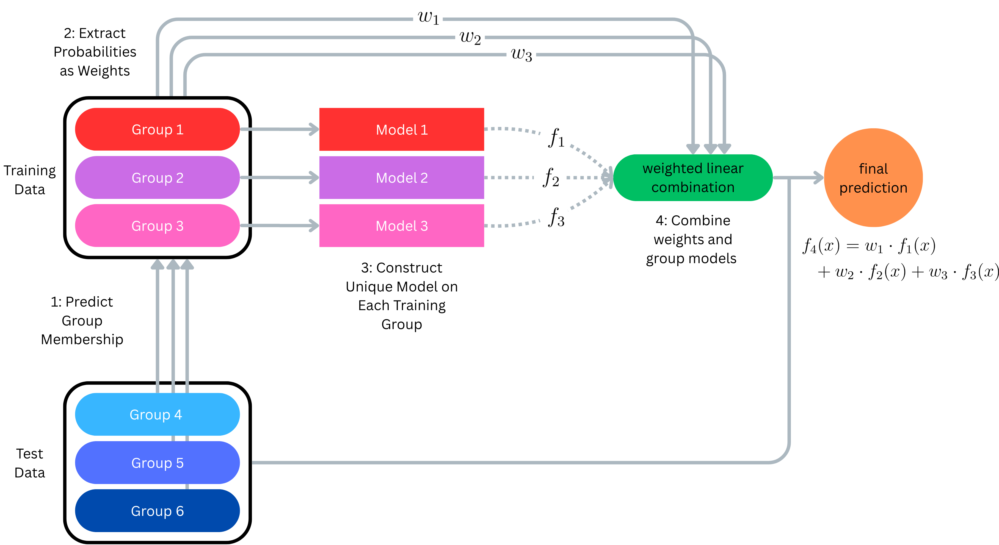

# weighted-trees
This code repository accompanies the manuscript titled "Weighted Sum-of-Trees Model for Clustered Data" by  (McCoy et al., 2025). The manuscript is currently in peer review. This README will be updated as the article gets closer to publication.

# Method Overview



# Repository Structure

The two main folders in this repository correspond to figures generated for **Section 3.1 Simulated Data** and **Section 3.2 Real Data Application**, respectively.

- `./3.1_Simulated-Data/`
  - `./out/`: This folder will contain the results of code run in `./3.1_Simulated-Data/`.
  - `simulation_setting_1+2.py`: Run simulations from *Simulation Setting 1* and *Simulation Setting 2*.
  - `simulation_setting_3.py`: Runs simulations *Simulation Setting 3*.
  - `print_plots.Rmd`: Prints nice plots in R from exported data.
  - `BART_sims.R`: This code tests BART on the synthetic data generated in `new_sims.py`.
- `./3.2_Real-Data-Analysis/`
  - `./data/`: This folder is where the user must download the external sarcoma data to run files in `./3.2_Real-Data-Analysis/`.
  - `data_cleaning.ipynb`: Cleans raw sarcoma files present in `./data/`.
  - `PCA.Rmd`: Prints PCA plot.
  - `sarcoma_analysis.ipynb`: Analyzes various methods on the sarcoma dataset.
  - `vivi_plots.Rmd`: Prints all VIVI plots.

Other folders include:
- `./figures/`: This folder contains the figure outputs of various files.

Finally, `demo.py` showcases our method on dummy data.


# Citation

To cite this repository, simply cite our manuscript:

```{TeX}
@article{mccoy2025weighted,
  title={Weighted Sum-of-Trees Model for Clustered Data},
  author={McCoy, Kevin and Wooten, Zachary and Tomczak, Katarzyna and Peterson, Christine B.},
  journal={TBD},
  volume={TBD},
  pages={TBD},
  year={2025},
  publisher={TBD}
}
```
